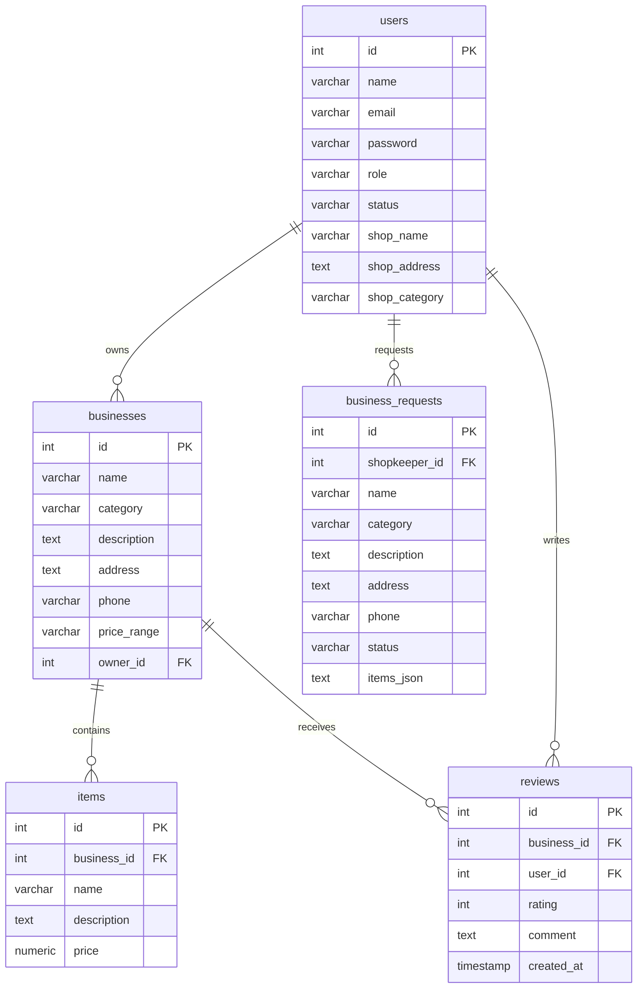

# Local Business Platform 💼

A Yelp-Inspired, full-stack directory web application that connects local businesses (restaurants, hotels, cafés, clubs, gyms, salons, tiffins, and markets) with nearby customers, controlled by a dedicated administration panel. 

The application features role-based workflows, dynamic listing proposals with items JSON mapping, a top-level administrative notification alert, and a premium glassmorphic dark/light visual interface.

---

## 🚀 Key Features

### 👤 Customer Experience
* **Discover & Search**: Look up local listings by category, name, or location.
* **Category Filters**: Highly reactive category pills styled with individual glowing active gradients (e.g., custom glows for Hotels, Cafes, Salons, etc.).
* **Detailed Modals**: Tabbed overlays to inspect shop details, check product menus/prices, and read user comments.
* **Directions**: Instant navigation routing via external Google Maps API.
* **Customer Reviews**: Submit star-based reviews and comments.

### 🏪 Shopkeeper Dashboard
* **Dynamic Shop Requests**: Submit store requests to the administrator with a custom inline product menu builder.
* **Multi-Shop Management**: Request and manage multiple shop listings from a single account using the **✚ Request Another Shop** dashboard toggle.
* **Verification Pre-fill**: The request form automatically pulls shop details entered during user registration.
* **Inventory Control**: Live tracking of listings, stats counters, product creations, edits, and deletions.

### 🛡️ Admin Dashboard (Separate Portal)
* **Isolated Portal**: Access controls restricted to a separate secure login panel (`/admin-login.html`).
* **Real-time Alert Banner**: Floating notification alerts at the top of the panel immediately notifying the administrator of new pending listing requests.
* **One-Click Provisioning**: View proposed business details and click **Grant** to automatically create the business listing and insert all proposed menu items.

---

## 🛠️ Technology Stack

* **Frontend**: Vanilla JavaScript (ES6+), HTML5, and customized HSL variable CSS (supporting smooth transitions and light/dark theme toggles).
* **Backend**: Node.js & Express.
* **Database**: PostgreSQL (Relational mapping, transactional scopes).
* **Security**: JSON Web Tokens (JWT) for role-based sessions, `bcryptjs` password hashing.

---

## 📂 Database Schema



---

## 🛠️ Getting Started

### 📋 Prerequisites
* [Node.js](https://nodejs.org/) (v18+)
* [PostgreSQL](https://www.postgresql.org/) (v14+) running locally

### ⚙️ Installation
1. **Clone the repository**:
   ```bash
   git clone https://github.com/sohan-12/Urban_business_platform.git
   cd Urban_business_platform
   ```

2. **Install dependencies**:
   ```bash
   npm install
   ```

3. **Configure Environment Variables**:
   Create a `.env` file in the root directory:
   ```env
   PORT=5000
   JWT_SECRET=your_super_secret_jwt_key
   DB_USER=postgres
   DB_PASSWORD=your_postgres_password
   DB_HOST=localhost
   DB_DATABASE=local_business_db
   DB_PORT=5432
   ```

4. **Initialize Database Schema & Seeding**:
   Execute the migration SQL files against your database pool, then seed mock data:
   ```bash
   # Run init, migration, and requests tables setup in PostgreSQL, then:
   node seed.js
   ```

5. **Start Server**:
   ```bash
   npm run dev
   # or
   node server.js
   ```
   Open `http://localhost:5000` in your web browser.

---

## 🧑‍💻 Manual Testing Scenarios

1. **Category Contrasts**: Open the customer landing page in dark mode. Click different categories (Hotels, Gyms, Cafes) to see the individual glowing gradients light up.
2. **Shopkeeper Request**: Sign up as a shopkeeper, fill in the proposed store details, add a few menu products, and submit. Verify you are shown the pending approval view detailing your request.
3. **Admin Grant**: Log in as admin via the **Admin Portal** button at `/admin-login.html` (e.g., email `sohan@gmail.com`). Verify that the top notification banner alert count increases. Click **Review** -> **Grant** to publish.
4. **Active Control**: Log back in as the shopkeeper; the pending screen is gone, replaced with active dashboard controls loaded with your approved store and products!
